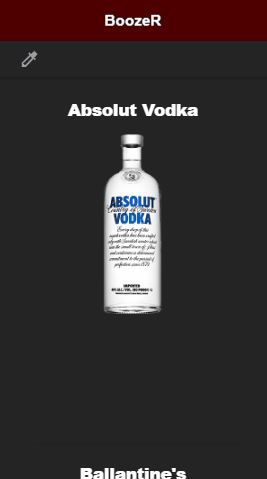

# Ionic-BoozeR
## El objetivo de esta app es ayudarte a elegir qué beber.

### Por defecto, paracada bebida se muestran su nombre y una imagen. 
### Si seleccionas una bebida en particular, aparecerá una lista de detalles junto a ella:
- Tipo
- Graduación de alcohol (Vol.)
- Precio por litro 
  

- Favorita (o no) 
  

## Finalmente, al tocar el icono del cuentagotas, nos aparece un filtro. Actualmente podemos filtrar por:
- Tipo
- Graduación Mínima
- Graduación Máxima
- Precio Máximo (por litro)
- Sólo Favoritas (o no)
  

